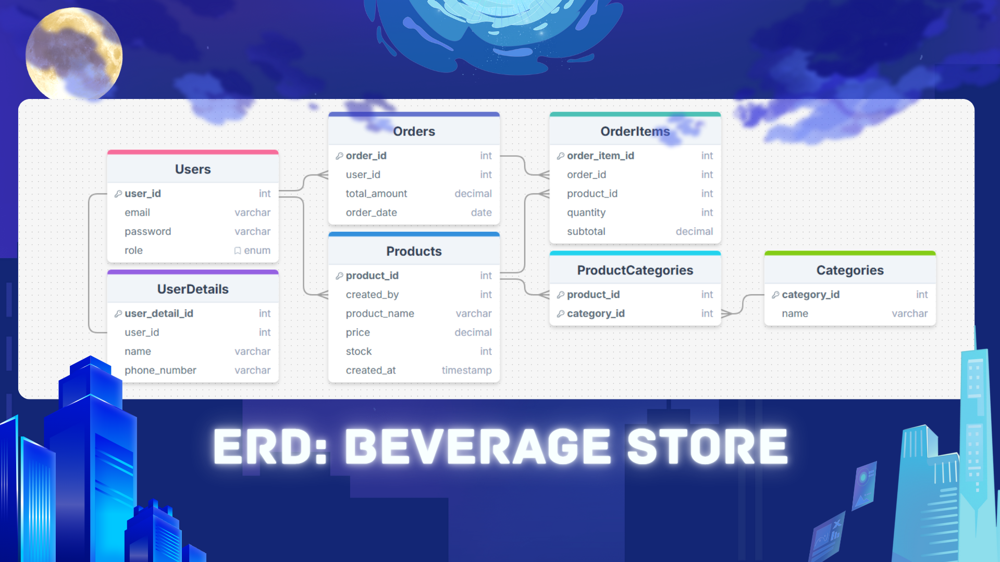

# 🧃 Beverage Store: Enterprise CLI Management System

<p align="center">
  <strong>A production-ready command-line interface for beverage store operations</strong><br>
  Built with Go, MySQL, and Clean Architecture principles
</p>

<p align="center">
  
  
  
</p>

---

## 📝 Overview

**Beverage Store CLI** is a comprehensive management system designed for beverage retail operations. The application implements role-based access control (RBAC), complete CRUD operations, and advanced reporting capabilities through an intuitive command-line interface.

Developed as a **Pair Programming Project** by the **BLACKMARKET Team** for Hacktiv8's Fulltime Golang Program.

---

## ✨ Key Features

### 🔐 Authentication & Authorization
- **User Registration**: Secure account creation with password hashing
- **Login System**: Session-based authentication
- **Role-Based Access**: Separate permissions for Admin and Customer roles

### 🛍️ Product Management (Admin)
- **Inventory Control**: Add, update, and delete beverage products
- **Category Assignment**: Link products to multiple categories
- **Stock Monitoring**: Track product availability

### 🏷️ Category Management (Admin)
- **Dynamic Categories**: Create custom beverage categories (Coffee, Tea, Juice, etc.)
- **Multi-Category Support**: Products can belong to multiple categories

### 🧾 Order Processing (Customer)
- **Shopping Cart**: Add multiple items to cart
- **Order Placement**: Complete purchase with order tracking
- **Order History**: View past transactions

### 📊 Business Intelligence Reports
- **Top Customer**: Identify user with most orders
- **Best-Selling Product**: Track most ordered beverage
- **Popular Category**: Analyze category performance

---

## 🏗️ Architecture & Tech Stack

### Backend Technologies
- **Language**: [Go](https://golang.org/) (Golang) 1.20+
- **Database**: [MySQL](https://www.mysql.com/) 8.0+
- **Environment Config**: [godotenv](https://github.com/joho/godotenv)
- **Testing**: Go's built-in testing framework

### Design Patterns
- **Clean Architecture**: Separation of concerns (Handler → Entity → Config)
- **Repository Pattern**: Database abstraction layer
- **MVC-like Structure**: CLI (View) → Handler (Controller) → Entity (Model)

### Project Structure
```
beverage_program/
├── cli/              # Command-line interface & role-based menus
│   ├── menu.go
│   ├── menuAdmin.go
│   ├── menuCustomer.go
│   └── order.go
├── config/           # Database connection configuration
│   └── db.go
├── database/         # SQL schema (DDL) and sample data (DML)
│   └── beverage.sql
├── docs/             # Documentation & ERD diagrams
│   └── ERD.png
├── entity/           # Go structs (Database models)
│   ├── user.go
│   ├── product.go
│   ├── category.go
│   ├── order.go
│   └── ...
├── handler/          # Business logic & database operations
│   ├── userHandler.go
│   ├── productHandler.go
│   ├── orderHandler.go
│   ├── reportHandler.go
│   └── *_test.go
├── main.go           # Application entry point
├── go.mod            # Go module dependencies
└── .env              # Environment variables
```

---

## 🗂️ Database Schema (ERD)

The application uses a normalized relational database with the following entities:

- **Users** → User authentication data
- **UserDetails** → Extended user information
- **Products** → Beverage inventory
- **Categories** → Product categorization
- **ProductCategories** → Many-to-many relationship (Products ↔ Categories)
- **Orders** → Customer purchase records
- **OrderItems** → Individual items in each order



---

## 🚀 Getting Started

### Prerequisites
- Go 1.20 or higher
- MySQL 8.0 or higher
- Git

### Installation

1. **Clone the Repository**
   ```bash
   git clone git@github.com:H8-FTGO-AOH-CLASSROOM-ALL-PHASE/p1-pair-project-beverage-store.git
   cd beverage_program
   ```

2. **Set Up Database**
   ```bash
   # Create database and import schema
   mysql -u root -p < database/beverage.sql
   ```

3. **Configure Environment**
   
   Create a `.env` file in the `beverage_program` directory:
   ```env
   # Local Development
   DB_USER=root
   DB_PASS=your_password
   DB_HOST=127.0.0.1
   DB_PORT=3306
   DB_NAME=beverage_store
   ```

4. **Install Dependencies**
   ```bash
   go mod download
   ```

5. **Run the Application**
   ```bash
   go run main.go
   ```

---

## 🧪 Testing

The project includes comprehensive unit tests for all core features:

```bash
# Run all tests
go test ./handler

# Run with verbose output
go test -v ./handler

# Run specific test file
go test -v ./handler/userHandler_test.go
```

### Test Coverage
- ✅ User authentication (success & failure cases)
- ✅ Product CRUD operations
- ✅ Category management
- ✅ Order processing
- ✅ Report generation

---

## 📦 Dependencies

```go
require (
    github.com/go-sql-driver/mysql v1.7.1
    github.com/joho/godotenv v1.5.1
)
```

---

## 🎯 Usage Examples

### Admin Workflow
1. Login as admin
2. Add new beverage categories
3. Create/update products
4. View sales reports

### Customer Workflow
1. Register new account
2. Browse available beverages
3. Add items to cart
4. Place order

---

## 📌 Key Implementation Details

- **Password Security**: Hashed password storage (recommended: bcrypt)
- **Input Validation**: Comprehensive validation for all user inputs
- **Error Handling**: Graceful error messages and recovery
- **Database Transactions**: ACID compliance for order processing
- **Buffered I/O**: Efficient CLI input handling with `bufio.Reader`

---

## 🔮 Future Enhancements

- [ ] REST API implementation
- [ ] Web-based admin dashboard
- [ ] Payment gateway integration
- [ ] Inventory alerts (low stock notifications)
- [ ] Customer loyalty program

---

## 🧑‍💻 Authors

Made with ❤️ by **BLACKMARKET Team**:
- [Fitry Yuliani](https://github.com/ftryyln)
- [Fahreza Alghifary](https://github.com/fabuzard)

**Hacktiv8 Fulltime Golang Program** – Pair Programming Project (Phase 1)

---

## 📄 License

This project is developed for educational purposes as part of Hacktiv8's curriculum.

---

<p align="center">
  <strong>Enterprise-Grade CLI, Built with Go 🚀</strong>
</p>
